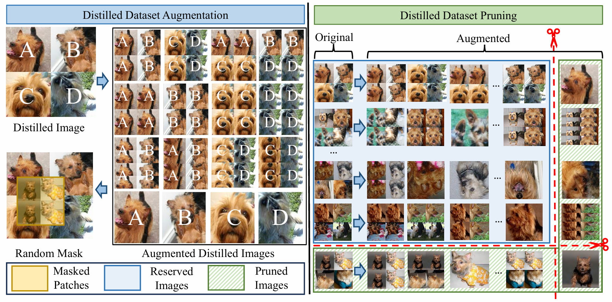

# Unleashing the Power of Each Distilled Image

## Highlights :sparkles:
- Distilled images are augmented by amplifying their local
 patches. 
- We introduce a bi-directional dynamic dataset pruning technique.



## Getting Started
Prepare the CIFAR10, CIFAR100, ImageWoof, ImageCat, ImageFruit, ImageNette, ImageNet10, ImageNet100, and ImageNet1K datasets.

## Experiment Commands
```
python ./main.py --subset "imagenet-1k" --arch-name "resnet18" --factor 2 --num-crop 5 --mipc 300 --ipc 50 --stud-name "resnet101" --re-epochs 300 --save "1k_ipc50_info_0.5_resnet101.txt" --re-batch-size 10 --re-epochs 300  --ratio 0.5 --Aratio 0.5
```

## Acknowledgement
This project is mainly developed based on the following works:
- [RDED](https://github.com/LINs-lab/RDED)
- [GIFT](https://github.com/LINs-lab/GIFT)
- [InfoBatch](https://github.com/NUS-HPC-AI-Lab/InfoBatch)

## Citation
If you find this work helpful, please cite:
```
@ARTICLE{11220248,
  author={Zhang, Jingxuan and Chen, Zhihua and Dai, Lei},
  journal={IEEE Transactions on Image Processing}, 
  title={Unleashing the Power of Each Distilled Image}, 
  year={2025},
  volume={},
  number={},
  pages={1-15},
  doi={10.1109/TIP.2025.3624626}}
```